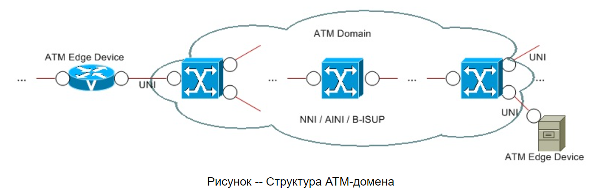
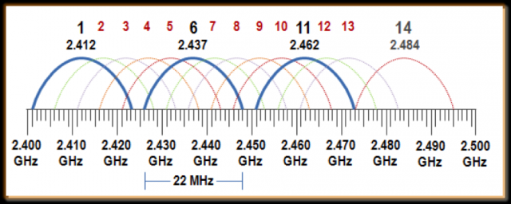

    
new

    

        
N вариант

        

            
1. 

        

        

            
2. 

        

        

            
3. 

        

        

            
4. 

        

        

            
5. 

        

        

            
6. 

        

        

            
7. 

        

        

            
8. 

        

        

            
9. 

        

        

            
10. 

        

        

            
11. 

        

        

            
12. 

        

    

    

        
Вариант 2.1

        

            
1. 3 любых практические реализации VLAN

            802.1Q, Cisco VTP, 3Com VLT, Cisco ISL
        

        

            
2. Даны VLAN, надо настроить порт на пропуск через него виланы (там транк)

        

        

            
3. Сколько из представленных портов - порты доступа

        

        

            
4. На схеме обозначен root. Обозначить все порты, которые будут designated (если комбинаций несколько, подходит любая правильная)

        

        

            
5. NBMA топологии

            xDSL, ATM, FR
        

        

            
6. Нарисовать домен ATM

            

        

        

            
7. Частота голосового канала

            300 - 3400 kHz
        

        

            
8. Характиристика Dial-up

            На абонентской стороне устанавливается внутренний либо внешний Dialup-модем, на провайдерской -- внутренний либо внешний, аналоговый либо цифровой модемный пул. Посредником является то, что в настоящее время принято называть традиционной телефонной сетью общего пользования -- PSTN (Public Switched Telephone Network) или, по-другому, POTS (Plain Old Telephone Service). PSTN охватывает сеть возможно разных АТС (лучше telephone exchanges). В настоящее время почти все ATC цифровые и применяются в основном цифровые модемные пулы. Офисные АТС -- PBX (Private Branch Exchanges) относятся к CPE. На RAS-сервере (которым может быть и маршрутизатор) происходит так называемое терминирование (termination) абонентских сессий.
        

        

            
9. 3 любых блока сетевого адаптера

        

        

            
10. Назвать пример медиаконвертера

            BALUN -- BALance-UNbalance -- двунаправленный преобразователь из коаксиального кабеля в витую пару и наоборот
        

        

            
11. Частоты вайфая (тут нужен был точный ответ)

            2.4GHz, 5.0GHz, 6GHz, 60GHz
        

        

            
12. Что такое телекоммуникационное оборудование

            Сетевое оборудование, связное оборудование, телевизионное оборудование
        

    

    

        
Вариант 2.2

        

            
1. Назовите три любые технологии агрегирования каналов

- Intel Adaptive Load Balancing (ALB)
- Broadcom SLB (Smart Load Balancing)
- HP NFT (Network Fault Tolerance) TLB (Transmit Load Balancing)
- Avaya & Nortel MLT (Multi-Link Trunking) и SMLT (Split MLT)
- 802.3ad (позже 802.1AX) SLA (Static Link Aggregation)
- 802.3ad (позже 802.1AX) LACP (Link Aggregation Control Protocol)
- Cisco Port Aggregation Protocol (PAgP)
- Cabletron SmartTrunking & DEC Hunt Groups
- Microsoft NLB (Network Load Balancing)
- Linux NIC Bonding
        

        

            
2. 

        

        

            
3. Сколько всего в данной спд транков в нотации циско при норм администрировании

        

        

            
4. изобразите любую валидную комбинацию альтернативных либо по другому блокер портов

        

        

            
5. два вида сетевых интерфейсов два любых isdn

1. BRI (Basic Rate Interface) -- базовый -- типичная схема: 2B (128 kbit/s) + 1D (I.430).
2. PRI (Primary Rate Interface) -- первичный -- схема: 23B (1,472 Mbit/s) + 1D либо 30B (1,92 Mbit/s) + 1D (I.431).
        

        

            
6. Дайте определение что такое локал луп

            Физический канал между граничащими CPE и SPE
        

        

            
7. назовите 3 любых разъема которые широко используются в WAN

        

        

            
8. Какая огранзиция занимется стандартазицией frame realy

            Frame Relay Forum, ITU-T (серии I и Q) и ANSI
        

        

            
9. каким каналом не перекрывается канал номер 6 в области 2.4

        

        

            
10. Приведите 2 любых примера гибридных технологий l2 и L3

1. Маршрутизирующие коммутаторы (routing switches) -- направление ретрансляции определяется на основе анализа информации, относящейся к третьему уровню в заголовке пакета; от маршрутизаторов отличаются виртуальностью сетевых интерфейсов.
2. Коммутаторы потоков (flow switches) -- выполняются попытки обнаружить продолжительные потоки пакетов между двумя станциями; после того, как факт наличия потока установлен на третьем уровне, дальнейшая коммутация осуществляется традиционным способом.
3. Коммутирующие маршрутизаторы (switching routers) -- выполняются попытки снизить расчетную нагрузку с маршрутизатора и возложить часть функций на уровень коммутации.
        

        

            
11. Что такое Auto MDI/MDIX

            Возможность автоматическго определения скорости и режима (физического соединения)
        

        

            
12. Что такое маршрутизатор

            работают на третьем уровне модели OSI и осуществляют передачу принятых пакетов в соответствии с маршрутной информацией  
        

    

        
Вариант 2.3

        

            
1. 3 технологии кластеризации

- Intel Adapter Fault Tolerance (AFT)
- Intel Switch Fault Tolerance (SFT)
- HP NFT Only -- аналог Intel AFT
- Cisco & IBM Link-State Tracking
- Cisco Virtual Switching System (VSS)
- Alcatel-Lucent Multi-Chassis Link Aggregation (MC-LAG) & PseudoWire (PW) redundancy
- Juniper Virtual Chassis
        

        

            
2. настроить порт доступа

        

        

            
3. сколько устройств с транками на топологии

        

        

            
4. root порты на топологии обозначить

        

        

            
5. классифицируйте АТМ

        

        

            
6. пропускная способность DS0

            64 kbit/s
        

        

            
7. нарисуйте ISDN

            

        

        

            
8. 3 любых отличия serial от Ethernet интерфейсов

        

        

            
9. 3 производителя активного сетевого оборудования high-end

- Intel (в готовом виде уже давно не производит) (Shiva, Express, NetStructure)
- 3COM (HP) (OfficeConnect, Baseline, SuperStack)
- HP (ProCurve)
- Cisco (множество серий коммутаторов Catalyst и маршрутизаторов)
- Nortel (сейчас Avaya) (Passport, Baystack, Netgear)
- Alcatel-Lucent (много серий)
- Avaya (много серий)
- Juniper (много серий)
- Allied Telesyn (сейчас Allied Telesis) (много серий)
- LevelOne (PalmCon, SohoCon, OfficeCon, ProCon, NetCon)
- SMC (Standard Microsystems Corporation) (TigerSwitch, Barricade Routers)
- Zyxel (Omni LAN, Dimension)
- Broadcom (Persona)
- Marvell (Prestera) и некоторые другие.
        

        

            
10. 3 любых модуляции wi-fi

1. DSSS (Direct Sequence Spread Spectrum) -- широкополосная модуляция с прямым расширением спектра.
2. FHSS (Frequency Hopping Spread Spectrum) -- широкополосная модуляция со скачкообразным изменением частоты.
3. OFDM (Orthogonal Frequency Division Multiplexing) -- ортогональное частотное мультиплексирование.
4. DFS (Dynamic Frequency Selection) -- динамический выбор частоты.
5. EDCA (Enhanced Distribution Coordinate Access) -- расширенный распределенный координируемый доступ.
6. HCCA (HCF Controlled Channel Access) -- бесконтроллерный доступ к каналу.
7. MIMO (Multiple-Input Multiple-Output) -- множественный доступ.
        

        

            
11. определение модель qos best effort

            При наилучшем возможном обслуживании делается все возможное для доставки пакета, но при этом ничего не гарантируется, то есть фактически QoS к пакетам не применяется.
        

        

            
12. что такое backplane

            На основе разделяемой шины (bus backplane) -- пакеты проходят через связывающую все порты общую высокоскоростную шину
        

    

        
Вариант 1.1

        

            
1. изобразить структуру тега 802.1q

1. TPID (Tag Protocol IDentifier) -- идентификатор протокола тегировки (является и признаком наличия тега, для 802.1Q равно 8100h).
2. User Priority -- приоритет пользователя.
3. CFI (Canonical Format Indicator) -- индикатор канонического формата MAC-адреса (для Ethernet равно нулю).
4. VID (VLAN IDentifier) -- идентификатор вилана (собственно значение тега).
        

        

            
2. настроить статическую агрегацию (вроде агрегацию, но мб маршрутизацию) каналов между S2 и S3 со стороны S2 с учетам всех изображенных виланов (там есть vlan 10, 20, 30)

        

        

            
3. привести пример поддержки виланов в Windows

        

        

            
4. Исходя из каких параметров выбирается корневой мост по протоколу STP

            Выбирается мост с наименьшим цифровым значением идентификатора мост
        

        

            
5. Раскрыть аббревиатуру STM54

            Synchronous Transport Module level 54
        

        

            
6. 3 любых устройства, входящих в структуру ATM систем

- AMT коммутатор
- граничные АТМ-устройства (маршрутизаторы, пользовательские станции, коммутаторы и т.д.)
        

        

            
7. привести пример инкапсуляции С ИСПОЛЬЗОВАНИЕМ для протокола PPP

            Одним примером может служить xDSL-система, в которой применяется PPPoE, PPPoE-клиент установлен на удаленной пользовательской станции, DSLAM работает с виланами.
        

        

            
8. привести 3 критерия классификации модема

1. Технология и СрПД.
2. Для коммутируемой либо выделенной линии.
3. Аналоговые либо цифровые.
4. Аппаратные либо программные.
5. Внешние (RS-232, USB, Ethernet и другие) либо внутренние (PCI и другие).
        

        

            
9. привести 3 любых совместимых стандарта Wi-Fi

            802.11b, 802.11g, 802.11n
        

        

            
10. в чем заключается коммутация CAPSUM

        

        

            
11. примести практический пример повторителя

            Необходимая длинна сегмента превышает допустимую, необходимо использовать повторитель
        

        

            
12. чем отличается американский регион wi-fi от европейского

        

    

    

        
Вариант 1.2

        

            
1. Что такое isl

            Cisco ISL (Inter-Switch Link) -- проприетарный протокол, аналогичный 802.1Q.
        

        

            
2. компьютеры соотнесены с виланами, настройте динамическую агрегацию каналов между с2 и с3 со стороны н3 с учетом всех виланов

        

        

            
3. Сколько устройств изображ на доске являются L2 устройствами

        

        

            
4. Приведите практический пример поддержки (возможно без поддержки) виланов ОС Windows

        

        

            
5. 

        

        

            
6. Приведите 3 примера устройств входящих в isdn систему

            ISDN-модемы, ISDN-коммутаторы, ISDN-терминал-адаптеры и т.д.
        

        

            
7. в чём заключается метод коммутации SNF

        

        

            
8. приведите пример декапсуляции с использ протоколов ppp l1-l7

- PHY
- ATM
- AAL5
- RFC 2684
- PPPoA
- PPP
- IP
        

        

            
9. С какими стандартами совместим стандарт 802.11 (b)?

            g, n, ad
        

        

            
10. 3 примера оbорудования CPE

            внешний Dialup-модем, NIC, ADSL модем
        

        

            
11. для чего нужен представитель пассивн сетевого оьорудования

            осуществляют выделение, подавление, разделение и объединение диапазонов частот
        

        

            
12. назовите традиционные регионы wifi

            Америка, европа, япония
        

    

    

        
Вариант 4.1

        

            
1. перечислите какие ус-ва способны выполнять IVR

            L3 коммутаторы, маршрутизаторы
        

        

            
2. На S1 сконфигурировать classic IVR

        

        

            
3. Три любые разновидности протокола STP

1. RSTP (Rapid STP) (802.1w)
2. PVST (Per-VLAN Spanning Tree)
3. PVST+
4. RPVST+ (Rapid PVST+)
        

        

            
4. Что такое port mirroring

            дублирование входящих или исходящих кадров определенного физического порта на другом порте
        

        

            
5. 3 стандатра dial up

            V.21, V.34, V.92
        

        

            
6. изобразить виртуальную цепь point to point

        

        

            
7. Виды TDM

1. Синхронные (synchronous) -- время формирования тайм-слотов четко связано с тактированием и предопределено.
2. Асинхронные (asynchronous) -- тайм-слоты формируются по мере надобности.
        

        

            
8. Пример демаркационной линии

            Разграничивает зоны ответственности абонента и провайдера
        

        

            
9. изобразить ibss

            

        

        

            
10. что такое коммутатор

            работают на втором уровне модели OSI и осуществляют целевую передачу принятых пакетов (кадров) в единственных правильных направлениях (в пределах сегментов)
        

        

            
11. что такое EoL [характеристика

        

        

            
12. 3 любые особенности голосового трафика с точки зрения QoS 

        

    

    

        
Вариант 3.1

        

            
1. Приведите пример мультикаст группы испульзуемой протоколами служебными второго уровня

        

        

            
2. По топологии вопрос: на S2 сконфигурировать виланы согласно VTP

        

        

            
3. пример связующего порта при агрегации каналов

        

        

            
4. вопрос на топологии: сколько портов на спд будут тэгирующими

        

        

            
5. Какие компоненты входят в состав сетевого интерфейса E1

        

        

            
6. изобразите dial-up

        

        

            
7. ADSL расшифровка

        

        

            
8. каким образом идентифицируется ATM

        

        

            
9. расчитать длину волны 5Ггц

        

        

            
10. в чем заключается модуляция OFDM

        

        

            
11. что такое learning в коммутации

        

        

            
12. примеры пассивного оборудования

        

    

old

    
1 вариант

    

        
1. Сколько может быть vlan?

        2^12
    

    

        
2. Назовите 3 режима port-security

        Protect, restrict, shutdown
    

    

        
3. Настроить обозначенный порт на работы

        (вроде транк просто настроить и м. б. создать vlan-ы) (int Fa0/1; switchport mode trunk; switchport trunk allowed vlan 20, 10, 2)
    

    

        
4. 3 технологии резервирования каналов (?для серверов)

        AFT, SFT, NFT only
    

    

        
5. Назвать частоту работы dialup

        0-4kHz
    

    

        
6. 3 технологии вида NBMA

        FR, ATM and xDSL
    

    

        
7. Что содержится в заголовке  ячейки ATM

        VPI (Virtual Path Identifier), VCI (Virtual Channel Identifier)
    

    

        
8. Структура домена ISDN

    

    

        
9. Что делает  ADSL сплиттер?

        разделение диапазона частот
    

    

        
10. store-forward как работает?

        коммутатор получает пакет полностью перед его ретрансляцией; анализируется адрес назначения и проверяется контрольная сумма
    

    

        
11. High-end производители активных сетевых устройств 3 шт

        Cisco, Intel, HP
    

    

        
12. wifi стандарты, которые совместимы с 802.11b

        точно 802.11g, неточно: 802.11n и 802.11ad
    

    
2 вариант

    

        
1. Аналог 802.1Q

        3COM VLT, Cisco ISL, Cisco VTP
    

    

        
2. Виды STP, применимые к топологии на доске

        PVST+ и возможно что-то еще
    

    

        
3. Сконфигурировать порт свича 1

    

    

        
4. Приведите пример использования связи порта при агрегации каналов

    

    

        
5. 2 типа виртуальных цепей

        PVCs, SVCs
    

    

        
6. нарисовать структуру домена ADSL

    

    

        
7. Скорость DS0

        64Кбит/c
    

    

        
8. Пример адреса ATM

    

    

        
9. Метод Cut Through

        Cut Through -- без промежуточной буферизации -- коммутатор не ожидает получения пакета целиком; анализируется лишь адрес назначения
    

    

        
10. Количество непересекающихся каналов в 802.11b

        3
    

    

        
11. 

    

    

        
12. Что входит в состав телекоммуникационного оборудования?

        связное оборудование, телевизионное и сетевое
    

    
3 вариант

    

        
1. Масштабируемые vlan

        Private VLAN
    

    

        
2. Настроить классическую маршрутизацию

    

    

        
3. Bridge ID

        Bridge Priority (2 байта) Bridge Address (6 байт) (802.1D)
    

    

        
4. Пример подинтерфейса на Linux

        eth0.10
    

    

        
5. ADSL расшифровка

        Asymmetric Digital Subscriber Loop
    

    

        
6. Какие протоколы устанавливают соответствие между виртуальными цепями и IP-адресами

        В случае с SVCs без ATM-адресов не обойтись. А вот в случае с PVCs обычно используют «напрашивающуюся» специфическую особенность NBMA-топологий, которая заключается в том, что IP-адреса можно связывать не с ATM-адресами, а с PVCs. При этом так же возможны два варианта связывания: статическое, то есть «вручную», и динамическое -- с помощью особого варианта протокола ARP под названием InARP (Inverse ARP)
    

    

        
7. Т1

        T1 = DS1 + <1DS0, 1,544 Mbit/s
    

    

        
8. Офисные АТС на английском

        IP PBX
    

    

        
9. Тип модуляции в 802.11a

        OFDM
    

    

        
10. SERDES - что это такое?

        Пара функциональных блоков, используются для преобразования данных между последовательным и параллельным интерфейсами в обоих направлениях
    

    

        
11. Пример L2-L3 технологий

        коммутатор и маршрутизатор?
    

    

        
12. Индикаторы LED на NIC

        link LED, speed LED и activity LED
    

    
4 вариант

    

        
1. Настроить  link aggregation по топологии

    

    

        
2. Назвать 3 СПЕЦИАЛИЗИРОВАННЫХ vlan

        native, private, provided, ?mangament
    

    

        
3. Какие роли у портов у корневого моста STP?

        designated
    

    

        
4. Состав заголовка 802.1q

        tpid, up, cfi, vid
    

    

        
5. Из чего состоит E1?

        ds1 +2ds0
    

    

        
6. LANE - расшифровка

        LAN Emulation
    

    

        
7. Состав заголовка 802.11b

        Signal, Service, Length, CRC
    

    

        
8. Модуляция ADSL

        DMT
    

    

        
9. К какому телекоммуникационному оборудованию относится стационарный телефон

        связное оборудование
    

    

        
10. Нарисовать пример стека коммутаторов

    

    

        
11. Что такое slip

        проскальзывание
    

    

        
12. 3 различия l2 и l3 коммутаторов

        l3 коммутаторы работают с пакетами и виртуальными l3 интерфейсами + ?
    

    
5 вариант

    

        
1. 3 протокола агрегирования

        LACP, PaGP, SLA
    

    

        
2. Что такое native-vlan?

        предназначен для передачи нетегированного трафика
    

    

        
3. Конфигурация Router-on-stick

    

    

        
4. При каких условиях данный порт(отметил на топологии) будет root?

    

    

        
5. Статистическое мультиплексирование в WAN

        При статистическом (statistical) мультиплексировании соотношение количеств тайм-слотов цифровых каналов в смешанном потоке соответствует востребованности этих цифровых каналов
    

    

        
6. 2 вида интерфейса ATM

        UNI, NNI
    

    

        
7. Нарисовать point-to-multipoint FR

    

    

        
8. Расшифровать SNAP

        Subnetwork Access Protocol
    

    

        
9. Что такое MSDU?

        MAC service data unit (MSDU, e.g. an Ethernet frame)
    

    

        
10. К какому типу телеком. оборудования относится коммутатор, записанный посредством PoE?

    

    

        
11. Что такое mediaconverter

        осуществляют преобразование СрПД
    

    

        
12. backplane на маршрутизаторе

        пакеты проходят через связывающую все порты общую высокоскоростную шину
    

    
6 вариант

    

        
1. Protect port security описать

    

    

        
2. Настроить ivr(on stick)

    

    

        
3. При каких условиях порты designated

    

    

        
4. Технологии используемые для кластеризации маршрутизаторов 

        HSRP, GLBP, VRRP, IRDP
    

    

        
5. Скорость e3

        34,368 Mbit/s
    

    

        
6. Модуляции xdsl

        CAP, TCPAM, DMT, QAM
    

    

        
7. Isdn схема

    

    

        
8. CPE расшифровать

        Customer Premises Equipment
    

    

        
9. Области частот в wifi

        2.4 и 5 ггц
    

    

        
10. 

    

    

        
11. Определение силового оборудования

        Под силовым оборудованием принято понимать технические средства для обеспечения телекоммуникационного оборудования питающим напряжением
    

    

        
12. Для чего ПЗУ на сетевом адаптере

        ПЗУ для хранения настроек по умолчанию (обычно подключается по шине I2C)
    

    
7 вариант

    

        
1. Pf

        port VLAN identifier
    

    

        
2. Обозначить root порты на топологии

        те, которые находятся на L2 коммутаторах и обращены к L3
    

    

        
3. На топологии настроить порт *(жёлтая) для доступа с admin Обозн * как fa0/1, а admin VLAN как vlan 20

        
interface fa0/1

        
switchport mode trunk

        
switchport trunk allowed 10,20

        
P.S. Некоторые ещё адрес vlan'а на коммутатор прописывали, но я не делала, потому что задание было настроить только порт

    

    

        
4. Port mirroring

        дублирование входящих и исходящих кадров одного порта на другом
    

    

        
5. Самый медленный интерфейс ISDN

        BRI (Basic rate interface): 2B+1D 128 kbit/s
    

    

        
6. DLCI

        Data-Link Connection Identifier - для идентификации VCs в пределах физ. каналов -> таблица коммутации (аналогично, как VPI/VCI в ATM)
    

    

        
7. Написать таблицу АТМ коммутации, состоящую из одной строки

    

    

        
8. Устройства с провайдерской стороны POTS

        Внутренний либо внешний, аналоговый либо цифровой модемный пул
    

    

        
9. Область частот 802.11а

        5 GHz
    

    

        
10. Поддержка какого протокола обеспечивает ipv6 мультикаст

        IPv6 MLD
    

    

        
11. 3 гибридные топологии маршрутизатор и коммутаторов

        Маршрутизирующие коммутаторы, коммутирующие маршрутизаторы, коммутаторы потоков
    

    

        
12. 3 любых блока структурной схемы сетевого адаптера

    

    
8 вариант

    

        
1. Что такое learning при коммутации

    

    

        
2. Дорисовать любую (или все возможные?) комбинации состояний портов при STP (схема)

    

    

        
3. Настроить IVR

    

    

        
4. 3 любых критерия по классификации VLAN

    

    

        
5. Типы сигнализации в WAN

        CCS, CAS
    

    

        
6. Frame Relay, пример строки коммутации из таблицы

    

    

        
7. ADSL - расшифровать букву А и что значит

        Asymmetric
    

    

        
8. Основной стандарт Dial-Up

        V.92
    

    

        
9. Протокол для поддержки IPv4 multicast в СПД

        IPv4 IGMP
    

    

        
10. PPDU - это (может BPDU?)

    

    

        
11. BALUN - это

        BALUN -- BALance-UNbalance -- двунаправленный преобразователь из коаксиального кабеля в витую пару и наоборот
    

    

        
12. CAM-таблица, для чего нужна

        в таблице хранится соответствие MAC-адресов и портов
    

    
9 вариант

    

        
1. 3 недостатка vlan

    

    

        
2. Ivr classic на ближайшем к роутеру коммутаторе

    

    

        
3. Обозначить любую возможную комбинацию designated портов

    

    

        
4. Cisco протокол совместимый с HSRP

    

    

        
5. Что такое STM-64

    

    

        
6. Что такое сигнализация в WAN

    

    

        
7. Нарисовать Adsl сплитер

    

    

        
8. Виды виртуальных цепей, поддерживаемые ATM

    

    

        
9. 3 технические характеристики 802.11n

    

    

        
10. Для чего в сетевых интерфейсах нужен Errprom

    

    

        
11. Пример мультикаст групп используемой актианым сетевым оборудованием

    

    

        
12. 3 производителя комплектующих для Ethernet сетевых адаптеров

    

    
10 вариант

    

        
1. Назовите три любых достоинства кластеров в маршрутизаторе

    

    

        
2. На топологии обозначить designated порты

    

    

        
3. На топологии настроить конфигурацию

    

    

        
4. Конфигурирование виланов в линукс

    

    

        
5. Что такое DSLAM

    

    

        
6. Скорость цифрового потока Е3

    

    

        
7. 3 отличия любых последовательности сетевых интерфейсов от ethernet интерфейсов

    

    

        
8. Расшифровать LMI

    

    

        
9. Для чего нужны несущие при модуляции

    

    

        
10. Факторы влияющие на производительность сетевого адаптера (“узкие места”)

    

    

        
11. Что такое коммутатор

    

    

        
12. что такое децибел(dB)

    

