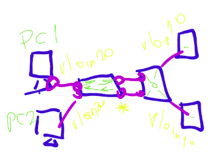
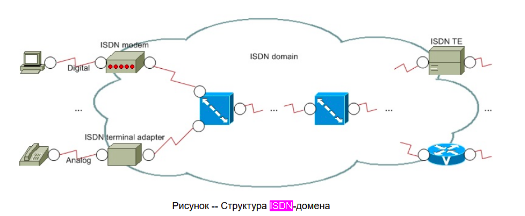
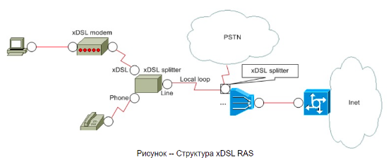
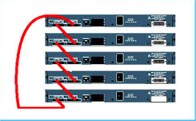
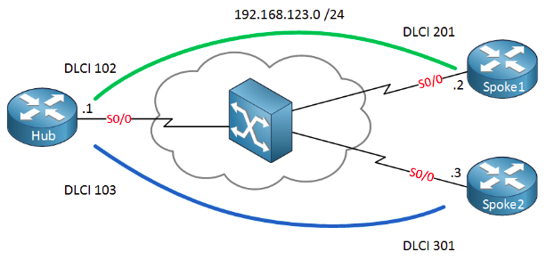
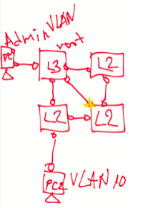
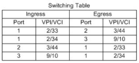
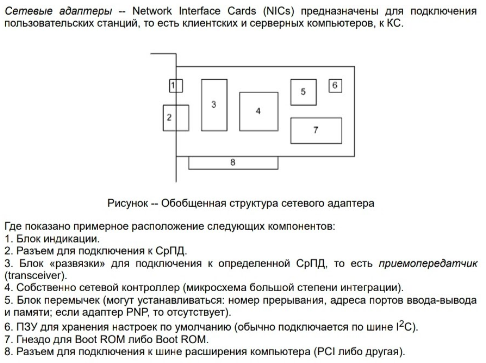

    
1 вариант

    

        
1. Сколько может быть vlan?

        2^12
    

    

        
2. Назовите 3 режима port-security

        Protect, restrict, shutdown
    

    

        
3. Настроить обозначенный порт на работы

        (вроде транк просто настроить и м. б. создать vlan-ы) (int Fa0/1; switchport mode trunk; switchport trunk allowed vlan 20, 10, 2)
    

    

        
4. 3 технологии резервирования каналов (?для серверов)

        AFT, SFT, NFT only
    

    

        
5. Назвать частоту работы dialup

        0-4kHz
    

    

        
6. 3 технологии вида NBMA

        FR, ATM and xDSL
    

    

        
7. Что содержится в заголовке  ячейки ATM

        VPI (Virtual Path Identifier), VCI (Virtual Channel Identifier)
    

    

        
8. Структура домена ISDN

    

    

        
9. Что делает  ADSL сплиттер?

        разделение диапазона частот
    

    

        
10. store-forward как работает?

        коммутатор получает пакет полностью перед его ретрансляцией; анализируется адрес назначения и проверяется контрольная сумма
    

    

        
11. High-end производители активных сетевых устройств 3 шт

        Cisco, Intel, HP
    

    

        
12. wifi стандарты, которые совместимы с 802.11b

        точно 802.11g, неточно: 802.11n и 802.11ad
    

    
2 вариант

    

        
1. Аналог 802.1Q

        3COM VLT, Cisco ISL, Cisco VTP
    

    

        
2. Виды STP, применимые к топологии на доске

        PVST+ и возможно что-то еще
    

    

        
3. Сконфигурировать порт свича 1

    

    

        
4. Приведите пример использования связи порта при агрегации каналов

    

    

        
5. 2 типа виртуальных цепей

        PVCs, SVCs
    

    

        
6. нарисовать структуру домена ADSL

    

    

        
7. Скорость DS0

        64Кбит/c
    

    

        
8. Пример адреса ATM

    

    

        
9. Метод Cut Through

        Cut Through -- без промежуточной буферизации -- коммутатор не ожидает получения пакета целиком; анализируется лишь адрес назначения
    

    

        
10. Количество непересекающихся каналов в 802.11b

        3
    

    

        
11. 

    

    

        
12. Что входит в состав телекоммуникационного оборудования?

        связное оборудование, телевизионное и сетевое
    

    
3 вариант

    

        
1. Масштабируемые vlan

        Private VLAN
    

    

        
2. Настроить классическую маршрутизацию

    

    

        
3. Bridge ID

        Bridge Priority (2 байта) Bridge Address (6 байт) (802.1D)
    

    

        
4. Пример подинтерфейса на Linux

        eth0.10
    

    

        
5. ADSL расшифровка

        Asymmetric Digital Subscriber Loop
    

    

        
6. Какие протоколы устанавливают соответствие между виртуальными цепями и IP-адресами

        В случае с SVCs без ATM-адресов не обойтись. А вот в случае с PVCs обычно используют «напрашивающуюся» специфическую особенность NBMA-топологий, которая заключается в том, что IP-адреса можно связывать не с ATM-адресами, а с PVCs. При этом так же возможны два варианта связывания: статическое, то есть «вручную», и динамическое -- с помощью особого варианта протокола ARP под названием InARP (Inverse ARP)
    

    

        
7. Т1

        T1 = DS1 + <1DS0, 1,544 Mbit/s
    

    

        
8. Офисные АТС на английском

        IP PBX
    

    

        
9. Тип модуляции в 802.11a

        OFDM
    

    

        
10. SERDES - что это такое?

        Пара функциональных блоков, используются для преобразования данных между последовательным и параллельным интерфейсами в обоих направлениях
    

    

        
11. Пример L2-L3 технологий

        коммутатор и маршрутизатор?
    

    

        
12. Индикаторы LED на NIC

        link LED, speed LED и activity LED
    

    
4 вариант

    

        
1. Настроить  link aggregation по топологии

    

    

        
2. Назвать 3 СПЕЦИАЛИЗИРОВАННЫХ vlan

        native, private, provided, ?mangament
    

    

        
3. Какие роли у портов у корневого моста STP?

        designated
    

    

        
4. Состав заголовка 802.1q

        tpid, up, cfi, vid
    

    

        
5. Из чего состоит E1?

        ds1 +2ds0
    

    

        
6. LANE - расшифровка

        LAN Emulation
    

    

        
7. Состав заголовка 802.11b

        Signal, Service, Length, CRC
    

    

        
8. Модуляция ADSL

        DMT
    

    

        
9. К какому телекоммуникационному оборудованию относится стационарный телефон

        связное оборудование
    

    

        
10. Нарисовать пример стека коммутаторов

    

    

        
11. Что такое slip

        проскальзывание
    

    

        
12. 3 различия l2 и l3 коммутаторов

        l3 коммутаторы работают с пакетами и виртуальными l3 интерфейсами + ?
    

    
5 вариант

    

        
1. 3 протокола агрегирования

        LACP, PaGP, SLA
    

    

        
2. Что такое native-vlan?

        предназначен для передачи нетегированного трафика
    

    

        
3. Конфигурация Router-on-stick

    

    

        
4. При каких условиях данный порт(отметил на топологии) будет root?

    

    

        
5. Статистическое мультиплексирование в WAN

        При статистическом (statistical) мультиплексировании соотношение количеств тайм-слотов цифровых каналов в смешанном потоке соответствует востребованности этих цифровых каналов
    

    

        
6. 2 вида интерфейса ATM

        UNI, NNI
    

    

        
7. Нарисовать point-to-multipoint FR

    

    

        
8. Расшифровать SNAP

        Subnetwork Access Protocol
    

    

        
9. Что такое MSDU?

        MAC service data unit (MSDU, e.g. an Ethernet frame)
    

    

        
10. К какому типу телеком. оборудования относится коммутатор, записанный посредством PoE?

    

    

        
11. Что такое mediaconverter

        осуществляют преобразование СрПД
    

    

        
12. backplane на маршрутизаторе

        пакеты проходят через связывающую все порты общую высокоскоростную шину
    

    
6 вариант

    

        
1. Protect port security описать

    

    

        
2. Настроить ivr(on stick)

    

    

        
3. При каких условиях порты designated

    

    

        
4. Технологии используемые для кластеризации маршрутизаторов 

        HSRP, GLBP, VRRP, IRDP
    

    

        
5. Скорость e3

        34,368 Mbit/s
    

    

        
6. Модуляции xdsl

        CAP, TCPAM, DMT, QAM
    

    

        
7. Isdn схема

    

    

        
8. CPE расшифровать

        Customer Premises Equipment
    

    

        
9. Области частот в wifi

        2.4 и 5 ггц
    

    

        
10. 

    

    

        
11. Определение силового оборудования

        Под силовым оборудованием принято понимать технические средства для обеспечения телекоммуникационного оборудования питающим напряжением
    

    

        
12. Для чего ПЗУ на сетевом адаптере

        ПЗУ для хранения настроек по умолчанию (обычно подключается по шине I2C)
    

    
7 вариант

    

        
1. Pf

        port VLAN identifier
    

    

        
2. Обозначить root порты на топологии

        те, которые находятся на L2 коммутаторах и обращены к L3
    

    

        
3. На топологии настроить порт *(жёлтая) для доступа с admin Обозн * как fa0/1, а admin VLAN как vlan 20

        
interface fa0/1

        
switchport mode trunk

        
switchport trunk allowed 10,20

        
P.S. Некоторые ещё адрес vlan'а на коммутатор прописывали, но я не делала, потому что задание было настроить только порт

    

    

        
4. Port mirroring

        дублирование входящих и исходящих кадров одного порта на другом
    

    

        
5. Самый медленный интерфейс ISDN

        BRI (Basic rate interface): 2B+1D 128 kbit/s
    

    

        
6. DLCI

        Data-Link Connection Identifier - для идентификации VCs в пределах физ. каналов -> таблица коммутации (аналогично, как VPI/VCI в ATM)
    

    

        
7. Написать таблицу АТМ коммутации, состоящую из одной строки

    

    

        
8. Устройства с провайдерской стороны POTS

        Внутренний либо внешний, аналоговый либо цифровой модемный пул
    

    

        
9. Область частот 802.11а

        5 GHz
    

    

        
10. Поддержка какого протокола обеспечивает ipv6 мультикаст

        IPv6 MLD
    

    

        
11. 3 гибридные топологии маршрутизатор и коммутаторов

        Маршрутизирующие коммутаторы, коммутирующие маршрутизаторы, коммутаторы потоков
    

    

        
12. 3 любых блока структурной схемы сетевого адаптера

    

    
8 вариант

    

        
1. Что такое learning при коммутации

    

    

        
2. Дорисовать любую (или все возможные?) комбинации состояний портов при STP (схема)

    

    

        
3. Настроить IVR

    

    

        
4. 3 любых критерия по классификации VLAN

    

    

        
5. Типы сигнализации в WAN

        CCS, CAS
    

    

        
6. Frame Relay, пример строки коммутации из таблицы

    

    

        
7. ADSL - расшифровать букву А и что значит

        Asymmetric
    

    

        
8. Основной стандарт Dial-Up

        V.92
    

    

        
9. Протокол для поддержки IPv4 multicast в СПД

        IPv4 IGMP
    

    

        
10. PPDU - это (может BPDU?)

    

    

        
11. BALUN - это

        BALUN -- BALance-UNbalance -- двунаправленный преобразователь из коаксиального кабеля в витую пару и наоборот
    

    

        
12. CAM-таблица, для чего нужна

        в таблице хранится соответствие MAC-адресов и портов
    

    
9 вариант

    

        
1. 3 недостатка vlan

    

    

        
2. Ivr classic на ближайшем к роутеру коммутаторе

    

    

        
3. Обозначить любую возможную комбинацию designated портов

    

    

        
4. Cisco протокол совместимый с HSRP

    

    

        
5. Что такое STM-64

    

    

        
6. Что такое сигнализация в WAN

    

    

        
7. Нарисовать Adsl сплитер

    

    

        
8. Виды виртуальных цепей, поддерживаемые ATM

    

    

        
9. 3 технические характеристики 802.11n

    

    

        
10. Для чего в сетевых интерфейсах нужен Errprom

    

    

        
11. Пример мультикаст групп используемой актианым сетевым оборудованием

    

    

        
12. 3 производителя комплектующих для Ethernet сетевых адаптеров

    

    
10 вариант

    

        
1. Назовите три любых достоинства кластеров в маршрутизаторе

    

    

        
2. На топологии обозначить designated порты

    

    

        
3. На топологии настроить конфигурацию

    

    

        
4. Конфигурирование виланов в линукс

    

    

        
5. Что такое DSLAM

    

    

        
6. Скорость цифрового потока Е3

    

    

        
7. 3 отличия любых последовательности сетевых интерфейсов от ethernet интерфейсов

    

    

        
8. Расшифровать LMI

    

    

        
9. Для чего нужны несущие при модуляции

    

    

        
10. Факторы влияющие на производительность сетевого адаптера (“узкие места”)

    

    

        
11. Что такое коммутатор

    

    

        
12. что такое децибел(dB)

    

